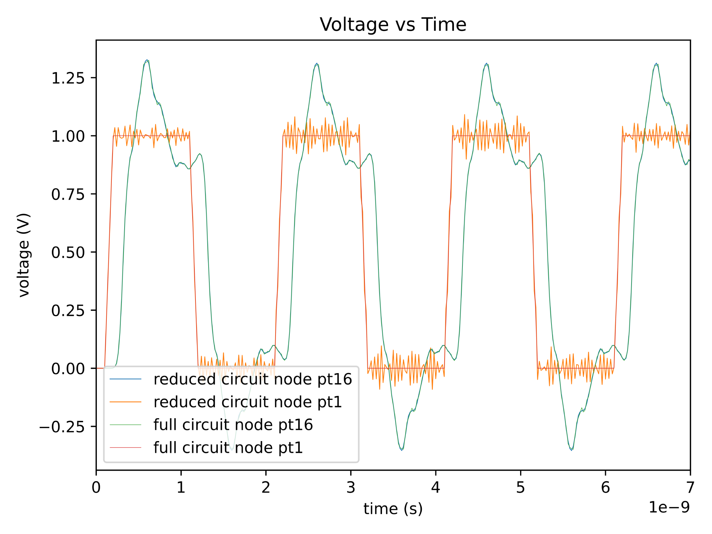
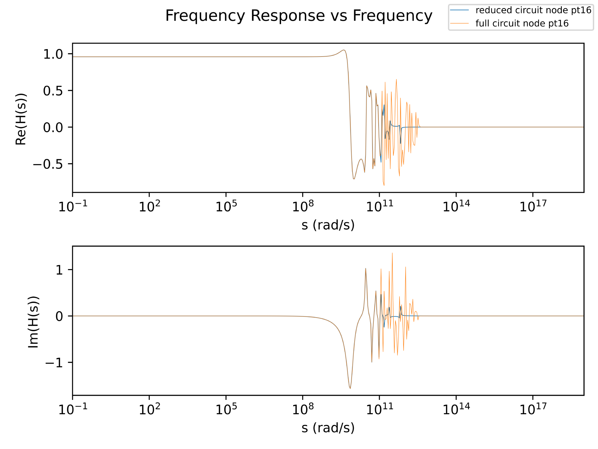

# Modified Nodal Analysis with Model Order Reduction

Implementation of a circuit simulator to test effectiveness of the PRIMA (Passive Reduced-order Interconnect
Macromodeling Algorithm) model order reduction technique.


## Installation

This project uses `pipenv`, so first obtain it:
```bash
python3 -m pip install pipenv
```

Obtain the source to this project:
```bash
git clone https://github.com/mm318/rlc-circuit-mor.git
cd rlc-circuit-mor/
pipenv shell
pipenv sync
```


## Usage

```
$ python3 main.py --help
usage: main.py [-h] -i I [I ...] -o O [O ...] [-r R] N

Run modified nodal analysis on a given network.

positional arguments:
  N                     filename of circuit (SPICE format)

optional arguments:
  -h, --help            show this help message and exit
  -i I [I ...], --input_sources I [I ...]
                        component name(s) of circuit inputs
  -o O [O ...], --output_nodes O [O ...]
                        node name(s) of circuit to observe
  -r R, --reduce R      experiment with model order reduction using given order

```

### Example

```bash
python3 main.py reference/clock_tree.sp -i v_clk_src -o pt1 pt16 --reduce 20
```
The full circuit model of the `clock_tree.sp` example has 2522 internal states, and the command above reduces the model
down to just 20 internal states. The following is a comparison of the simulation results:



There are imperfections as expected. However, the simulation runtime for the same number of timesteps for the
full circuit model is around 5 seconds and 0.015 seconds for the reduced circuit model.



The frequency analysis shows that frequency response of the reduced circuit model is accurate up to a certain point.


## References

The PRIMA technique originated from the following paper:

Odabasioglu, Altan & Çelik, Menşure & Pileggi, Lawrence. (1998). PRIMA: Passive reduced-order interconnect macromodeling algorithm.
Computer-Aided Design of Integrated Circuits and Systems, IEEE Transactions on. 17. 645-654. 10.1109/43.712097. 
